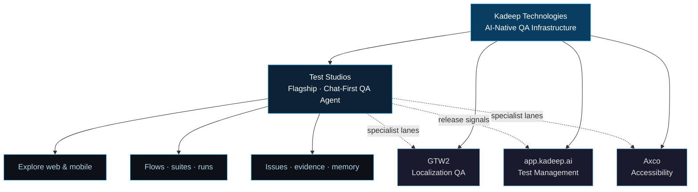
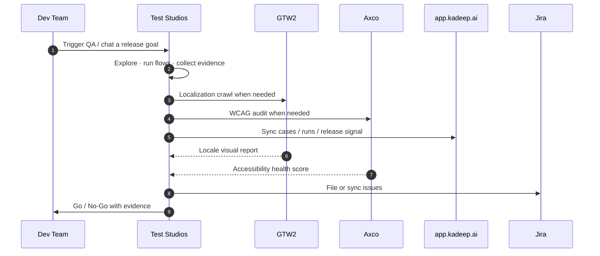

<div align="center">

<!-- ANIMATED WAVE HEADER — dark / light adaptive -->
<picture>
  <source media="(prefers-color-scheme: dark)" srcset="https://capsule-render.vercel.app/api?type=waving&color=0:0d1117,50:0d2137,100:0a3d62&height=220&section=header&text=Kadeep%20Technologies&fontSize=52&fontColor=ffffff&animation=fadeIn&fontAlignY=38&desc=AI-Native%20QA%20Infrastructure%20%C2%B7%20Led%20by%20Test%20Studios&descAlignY=56&descSize=17&descColor=7ec8e3" />
  <source media="(prefers-color-scheme: light)" srcset="https://capsule-render.vercel.app/api?type=waving&color=0:e8f4fc,50:b8d9ef,100:0a3d62&height=220&section=header&text=Kadeep%20Technologies&fontSize=52&fontColor=0d1117&animation=fadeIn&fontAlignY=38&desc=AI-Native%20QA%20Infrastructure%20%C2%B7%20Led%20by%20Test%20Studios&descAlignY=56&descSize=17&descColor=0a3d62" />
  
</picture>

<!-- ANIMATED TYPING TAGLINE — dark / light adaptive -->
<picture>
  <source media="(prefers-color-scheme: dark)" srcset="https://readme-typing-svg.demolab.com?font=Fira+Code&weight=600&size=20&duration=2800&pause=900&color=4FC3F7&center=true&vCenter=true&multiline=false&width=780&height=48&lines=Test+Studios+%E2%80%94+Chat-First+QA+Agent+for+Web+%26+Mobile+%F0%9F%A7%AA;Explore%2C+flow%2C+run%2C+and+file+issues+from+one+conversation+%F0%9F%92%AC;Agentic+Localization+QA+across+50%2B+Locales+%F0%9F%8C%90;Automated+WCAG+Accessibility+Compliance+%E2%99%BF;If+it%27s+repetitive+or+broken+%E2%80%94+we+automate+it+%E2%9A%A1" />
  <source media="(prefers-color-scheme: light)" srcset="https://readme-typing-svg.demolab.com?font=Fira+Code&weight=600&size=20&duration=2800&pause=900&color=0A3D62&center=true&vCenter=true&multiline=false&width=780&height=48&lines=Test+Studios+%E2%80%94+Chat-First+QA+Agent+for+Web+%26+Mobile+%F0%9F%A7%AA;Explore%2C+flow%2C+run%2C+and+file+issues+from+one+conversation+%F0%9F%92%AC;Agentic+Localization+QA+across+50%2B+Locales+%F0%9F%8C%90;Automated+WCAG+Accessibility+Compliance+%E2%99%BF;If+it%27s+repetitive+or+broken+%E2%80%94+we+automate+it+%E2%9A%A1" />
  
</picture>

<br/>

<!-- BADGES -->
[](https://kadeep.ai)
[](https://teststudios.ai)
[](https://www.linkedin.com/company/kadeep-ai)
[](https://kadeep.ai/demo)

<br/>


</div>

---

## 🧠 About Kadeep


At **Kadeep Technologies**, we build AI-native QA infrastructure so engineering teams **move faster, release confidently, and scale predictably**.

Manual regression eats sprints. Localization breaks silently. Accessibility slips until users complain. Most QA stacks are fragmented — a TMS here, a script runner there, a one-off a11y scan before launch.

**Our flagship is [Test Studios](https://teststudios.ai)** — a chat-first QA agent with its own browser runtime and virtual mobile devices. Specialist products around it handle localization (GTW2), accessibility (Axco), and centralized test management (app.kadeep.ai).

> *"KaDeep helped us move from brittle automations to reliable agents. We finally have confidence in execution quality."*
> — **Summit**, Product Manager, Setu

<br/>

---

## 🧪 Flagship — [Test Studios](https://teststudios.ai)

<div align="center">

### Chat-first QA agent for web & mobile

*Talk to a senior QA engineer. It explores your app, writes natural-language flows, runs them, files issues, and remembers what it learned.*

[](https://teststudios.ai)
[](https://kadeep.ai/demo)

<br/>


</div>

<br/>

| Agent | Execution | Memory & ops |
|:---|:---|:---|
| Chat-first senior-QA loop | Playwright browser sessions | Governed memory (app / you / team) |
| Natural-language flows & suites | Virtual iOS / Android devices | Credentials in a separate vault |
| Explores web apps or mobile builds | Runs, evidence, artifacts | Issues filed from the conversation |
| Skills-based specialization | Live browser / device view | MCP tools for Cursor / Claude |

---

## 🗺️ Platform Ecosystem



---

## 🧭 Which product should I use?

| If you need… | Use | Why |
|:---|:---|:---|
| Chat-driven exploratory + automated QA on web or mobile | **[Test Studios](https://teststudios.ai)** | Agent explores, writes flows, executes, and files issues in one conversation |
| Central test cases, runs, coverage, go / no-go | **[app.kadeep.ai](https://app.kadeep.ai)** | AI-native test management and release signals |
| Visual / localization QA across many locales | **[GTW2](https://gtw2.ai)** | Agentic crawl + visual reports across 50+ locales |
| Continuous WCAG accessibility monitoring | **[Axco](https://accessibility.kadeep.ai)** | Ongoing a11y audits, health scores, sprint fix plans |

---

## 🧩 Specialist products

<table>
<tr>
<td width="50%" valign="top">

### 🧪 [app.kadeep.ai](https://app.kadeep.ai)


AI-assisted test management — generate cases, track runs, sync defects, surface go / no-go.

- AI-generated test cases
- Run tracking & coverage
- Defect sync (e.g. Jira)
- Release go / no-go signals

</td>
<td width="50%" valign="top">

### 🌐 [GTW2](https://gtw2.ai)


Agentic localization QA — crawl production across 50+ locales and ship visual QA reports.

- 50+ locale crawl
- Layout / missing-string checks
- RTL failure detection
- Per-release visual reports

</td>
</tr>
<tr>
<td width="50%" valign="top">

### ♿ [Axco](https://accessibility.kadeep.ai)


Accessibility that audits itself every release — WCAG health, sprint plans, AI code diffs.

- WCAG 2.1 / 2.2 checks
- Health score per release
- P1 / P2 sprint fix plans
- Jira / Linear export

</td>
<td width="50%" valign="top">

### 🏢 Platform


Test Studios is the primary surface. Specialists plug into the same QA story — functional, l10n, a11y, release ops.

- Flagship: [teststudios.ai](https://teststudios.ai)
- Company: [kadeep.ai](https://kadeep.ai)
- Demo: [kadeep.ai/demo](https://kadeep.ai/demo)
- Blog: [kadeep.ai/blog](https://kadeep.ai/blog)

</td>
</tr>
</table>

---

## 📊 QA Pipeline — How Kadeep Works



---

## ⚔️ Why Kadeep?

<div align="center">

| Without Kadeep | With Kadeep |
|:---|:---|
| Manual regression eats sprint cycles | **Test Studios** explores and runs flows from chat |
| Scripts break; only engineers can maintain them | Natural-language flows + agent-driven execution |
| Localization bugs reach users silently | **GTW2** audits locales on release |
| Accessibility checked once at launch | **Axco** monitors WCAG across deploys |
| QA tools are siloed | One ecosystem — flagship agent + specialist lanes |
| Go / no-go is a gut call | Evidence-backed release signals via the platform |

</div>

---

## 📈 The Problem We Solve


---

## 🔒 Our Philosophy

<div align="center">

```
╔══════════════════════════════════════════════════════════════╗
║                                                              ║
║     BUILD SMART.    SHIP CONFIDENTLY.    SCALE PREDICTABLY.  ║
║                                                              ║
║    Quality is not a checkpoint — it's a continuous system.   ║
║         Test Studios is how that system starts.              ║
║                                                              ║
╚══════════════════════════════════════════════════════════════╝
```

</div>

---

## 📬 Get in Touch

<div align="center">

| | Link |
|:---:|:---|
| 🧪 | **Test Studios (flagship):** [teststudios.ai](https://teststudios.ai) |
| 🌐 | **Company:** [kadeep.ai](https://kadeep.ai) |
| 📋 | **Test Management:** [app.kadeep.ai](https://app.kadeep.ai) |
| 🌍 | **Localization QA:** [gtw2.ai](https://gtw2.ai) |
| ♿ | **Accessibility:** [accessibility.kadeep.ai](https://accessibility.kadeep.ai) |
| 💼 | **LinkedIn:** [linkedin.com/company/kadeep-ai](https://www.linkedin.com/company/kadeep-ai) |
| 📖 | **Blog:** [kadeep.ai/blog](https://kadeep.ai/blog) |
| 📩 | **Book a Demo:** [kadeep.ai/demo](https://kadeep.ai/demo) |

<br/>

[](https://kadeep.ai/demo)
[](https://teststudios.ai)

</div>

---

<div align="center">

<picture>
  <source media="(prefers-color-scheme: dark)" srcset="https://capsule-render.vercel.app/api?type=waving&color=0:0a3d62,50:0d2137,100:0d1117&height=120&section=footer&fontSize=14&fontColor=7ec8e3&text=Kadeep%20Technologies%20%C2%A9%202025%E2%80%932026&fontAlignY=65" />
  <source media="(prefers-color-scheme: light)" srcset="https://capsule-render.vercel.app/api?type=waving&color=0:0a3d62,50:b8d9ef,100:e8f4fc&height=120&section=footer&fontSize=14&fontColor=0d1117&text=Kadeep%20Technologies%20%C2%A9%202025%E2%80%932026&fontAlignY=65" />
  
</picture>

</div>
