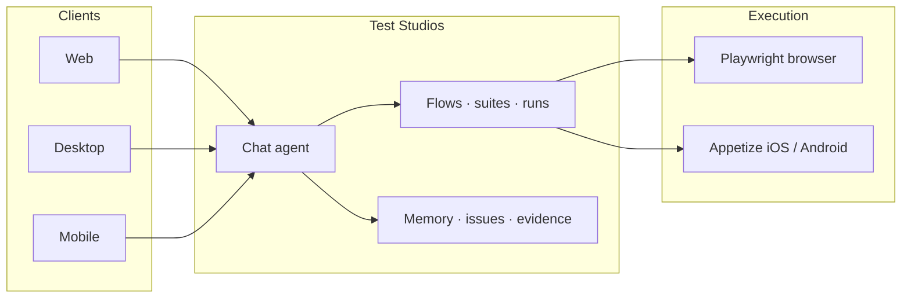
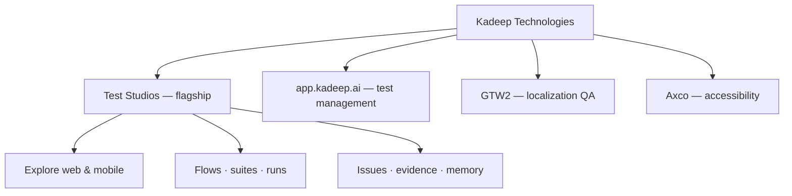
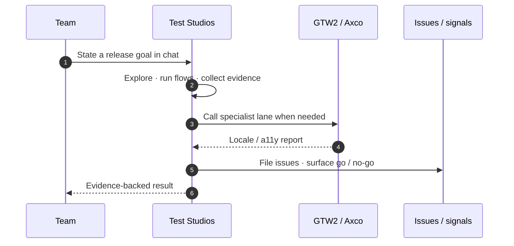

<!-- Wave without embedded title — text was clipping on capsule-render -->
<picture>
  <source media="(prefers-color-scheme: dark)" srcset="https://capsule-render.vercel.app/api?type=waving&color=0:0d2137,50:0a3d62,100:1a6591&height=140&section=header" />
  <source media="(prefers-color-scheme: light)" srcset="https://capsule-render.vercel.app/api?type=waving&color=0:d6eaf8,50:7eb8d9,100:0a3d62&height=140&section=header" />
  
</picture>

# Kadeep Technologies

**AI-native QA infrastructure** — led by **[Test Studios](https://teststudios.ai)**

 

<picture>
  <source media="(prefers-color-scheme: dark)" srcset="https://readme-typing-svg.demolab.com?font=Fira+Code&weight=600&size=18&duration=3000&pause=1000&color=4FC3F7&center=true&vCenter=true&width=720&height=40&lines=Chat-first+QA+agent+for+web+%26+mobile;Explore+%C2%B7+flow+%C2%B7+run+%C2%B7+file+issues;Specialist+lanes+for+l10n+%26+accessibility" />
  <source media="(prefers-color-scheme: light)" srcset="https://readme-typing-svg.demolab.com?font=Fira+Code&weight=600&size=18&duration=3000&pause=1000&color=0A3D62&center=true&vCenter=true&width=720&height=40&lines=Chat-first+QA+agent+for+web+%26+mobile;Explore+%C2%B7+flow+%C2%B7+run+%C2%B7+file+issues;Specialist+lanes+for+l10n+%26+accessibility" />
  
</picture>

 

 

---

## What we build

Kadeep builds AI-native QA products for teams that ship continuously.

**[Test Studios](https://teststudios.ai)** is the flagship — a chat-first QA agent with a real browser runtime and virtual mobile devices. Around it: test management, localization QA, and accessibility as specialist products.

> *“KaDeep helped us move from brittle automations to reliable agents. We finally have confidence in execution quality.”*
> — **Summit**, Product Manager, Setu

---

## Flagship — Test Studios

### Chat-first QA agent for web & mobile

Talk to a senior QA engineer. It explores your app, writes natural-language flows, runs them in a browser or on a virtual device, files issues, and remembers what it learned.

 

 

### Product model

### Capabilities

| Layer | What you get |
|:---|:---|
| **Agent** | Chat-first QA loop, skill-based specialization, natural-language flows |
| **Execution** | Playwright sessions, Appetize virtual devices, live view + artifacts |
| **Memory** | Governed layers (app / you / team), credentials in a separate vault |
| **Ops** | Suites, runs, issues from the conversation, MCP for Cursor / Claude |

---

## Platform map

---

## Which product should I use?

| Need | Product | Role |
|:---|:---|:---|
| Chat-driven exploratory + automated QA (web / mobile) | **[Test Studios](https://teststudios.ai)** | Flagship agent |
| Central cases, runs, coverage, go / no-go | **[app.kadeep.ai](https://app.kadeep.ai)** | Test management |
| Visual / localization QA across locales | **[GTW2](https://gtw2.ai)** | Localization specialist |
| Continuous WCAG monitoring | **[Axco](https://accessibility.kadeep.ai)** | Accessibility specialist |

---

## Specialist products

<table>
<tr>
<td width="33%" valign="top">

### [app.kadeep.ai](https://app.kadeep.ai)

AI-assisted cases, runs, defect sync, release go / no-go.

</td>
<td width="33%" valign="top">

### [GTW2](https://gtw2.ai)

Agentic crawl across 50+ locales with visual QA reports.

</td>
<td width="33%" valign="top">

### [Axco](https://accessibility.kadeep.ai)

WCAG 2.1 / 2.2 checks, health scores, sprint fix plans.

</td>
</tr>
</table>

---

## How a release run works

---

## Why teams use Kadeep

| Pain | With Kadeep |
|:---|:---|
| Manual regression eats sprints | Test Studios explores and runs flows from chat |
| Only engineers can maintain brittle scripts | Natural-language flows + agent execution |
| L10n / a11y checked late or never | GTW2 and Axco as continuous specialist lanes |
| Siloed QA tools | One stack — flagship agent + specialists |

---

## Contact

| | |
|:---|:---|
| **Test Studios** | [teststudios.ai](https://teststudios.ai) |
| **Company** | [kadeep.ai](https://kadeep.ai) |
| **Test management** | [app.kadeep.ai](https://app.kadeep.ai) |
| **Localization** | [gtw2.ai](https://gtw2.ai) |
| **Accessibility** | [accessibility.kadeep.ai](https://accessibility.kadeep.ai) |
| **LinkedIn** | [KaDeep AI](https://www.linkedin.com/company/kadeep-ai) |
| **Blog** | [kadeep.ai/blog](https://kadeep.ai/blog) |
| **Demo** | [kadeep.ai/demo](https://kadeep.ai/demo) |

 

---

<picture>
  <source media="(prefers-color-scheme: dark)" srcset="https://capsule-render.vercel.app/api?type=waving&color=0:1a6591,50:0a3d62,100:0d2137&height=100&section=footer" />
  <source media="(prefers-color-scheme: light)" srcset="https://capsule-render.vercel.app/api?type=waving&color=0:0a3d62,50:7eb8d9,100:d6eaf8&height=100&section=footer" />
  
</picture>

Kadeep Technologies · © 2025–2026

