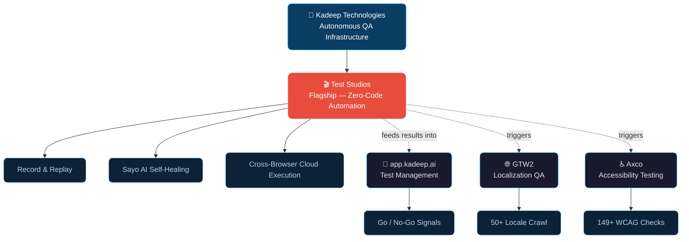
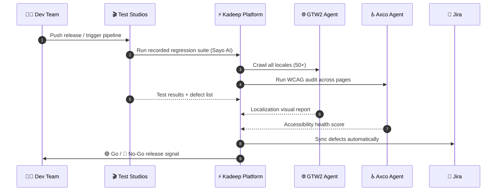
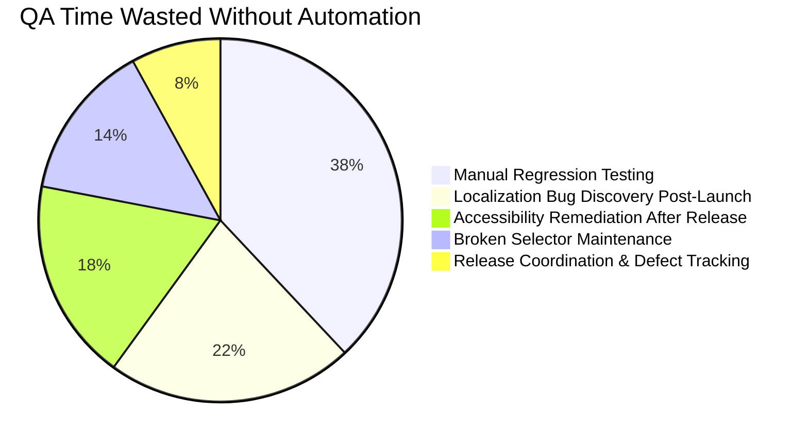

<div align="center">

<!-- ANIMATED WAVE HEADER — dark/light adaptive -->
<picture>
  <source media="(prefers-color-scheme: dark)" srcset="https://capsule-render.vercel.app/api?type=waving&color=0:0d1117,50:0d2137,100:0a3d62&height=220&section=header&text=Kadeep%20Technologies&fontSize=52&fontColor=ffffff&animation=fadeIn&fontAlignY=38&desc=Autonomous%20QA%20Infrastructure%20for%20Modern%20Software%20Teams&descAlignY=56&descSize=17&descColor=7ec8e3">
  <source media="(prefers-color-scheme: light)" srcset="https://capsule-render.vercel.app/api?type=waving&color=0:e6f2fa,50:cfe8f7,100:a9d6ef&height=220&section=header&text=Kadeep%20Technologies&fontSize=52&fontColor=0a3d62&animation=fadeIn&fontAlignY=38&desc=Autonomous%20QA%20Infrastructure%20for%20Modern%20Software%20Teams&descAlignY=56&descSize=17&descColor=1a6591">
  
</picture>

<!-- ANIMATED TYPING TAGLINE — Test Studios leads -->


<br/>

<!-- BADGES -->
[](https://kadeep.ai)
[](https://app.kadeep.ai)
[](https://www.linkedin.com/company/kadeep-ai)
[](https://kadeep.ai/demo)

<br/>


</div>

---

## 🧠 About Kadeep

At **Kadeep Technologies**, we design and develop AI-powered QA products and automation platforms that help engineering teams **move faster, release confidently, and scale effortlessly**.

Manual regression wastes sprints. Localization breaks silently. Accessibility slips until users complain. QA tools are scattered, fragile, and built for yesterday's workflows.

**We built Kadeep because every QA tool we tried was either too manual or too brittle.**

> *"KaDeep helped us move from brittle automations to reliable agents. We finally have confidence in execution quality."*
> — **Summit**, Product Manager, Setu

<br/>

---

<!-- ============================================= -->
<!-- 🎬 FLAGSHIP: TEST STUDIOS -->
<!-- ============================================= -->

## 🎬 Test Studios — Our Flagship Product

<div align="center">

### *If you can use a website, you can automate tests for it.*


**[🚀 Launch Test Studios →](https://app.kadeep.ai)**

</div>

<!--
  ⚠️ PLACEHOLDER NOTICE:
  The feature list below carries over from the previous "KaDeep Studios" entry.
  Confirm with real Test Studios copy — new features, integrations, screenshots,
  and any metrics (e.g. "X tests automated", "Y% faster than Selenium") before
  this goes live. Do not ship unverified claims.
-->

Test Studios is record-and-replay browser automation, rebuilt as our core product. It records every action on your site and converts it into a structured, replayable, self-healing test — no engineering required.

| Capability | What it does |
|---|---|
| 🎥 **Record & Replay** | Capture test flows by simply using your site — no scripting |
| 🤖 **Sayo AI Self-Healing** | Selectors auto-repair when your UI changes, so tests don't break on every deploy |
| ☁️ **Cross-Browser Cloud Execution** | Run suites across browsers and devices without managing infrastructure |
| 🧩 **Zero Setup** | No Selenium/Playwright expertise, no grid to maintain |
| 👥 **Built for Everyone** | PMs, QAs, and BAs can build and own automation — not just developers |
| 🔁 **Full Regression Coverage** | Eliminates manual regression cycles entirely |

<div align="center">

<!-- 🖼️ PLACEHOLDER: insert a real product screenshot or GIF of Test Studios here -->
<!--  -->

</div>

---

## 🗺️ Platform Ecosystem



---

## 🧭 Which Product Should I Use?

| I need to... | Use |
|---|---|
| Automate browser tests with no code | 🎬 **Test Studios** |
| Track test cases, runs, and release go/no-go signals | 🧪 app.kadeep.ai |
| Catch broken translations or RTL layout bugs across locales | 🌐 GTW2 |
| Monitor WCAG accessibility compliance every release | ♿ Axco |
| Run one release pipeline that covers all of the above | ⚡ The full Kadeep platform (see pipeline below) |

---

## 🚀 Also in the Platform

<table>
<tr>
<td width="33%" valign="top">

### 🧪 [app.kadeep.ai](https://app.kadeep.ai)
**Test Management**


AI agents generate test cases, execute runs, log defects, and deliver release go/no-go signals.

- ✅ AI-generated test cases
- ✅ Defect logging with Jira sync
- ✅ Coverage dashboards

</td>
<td width="33%" valign="top">

### 🌐 [GTW2](https://gtw2.ai)
**Localization QA**


Crawls your live site across 50+ locales and generates full visual QA reports on every release.

- ✅ RTL failure detection
- ✅ Visual regression reports
- ✅ Zero TMS integration required

</td>
<td width="33%" valign="top">

### ♿ [Axco](https://accessibility.kadeep.ai)
**Accessibility Testing**


Continuously monitors WCAG compliance across every deploy — not just at launch.

- ✅ 149+ violations mapped to WCAG
- ✅ P1/P2 sprint fix plans
- ✅ AI-generated code diffs

</td>
</tr>
</table>

---

## 📊 QA Pipeline — How Kadeep Works



---

## ⚔️ Why Kadeep?

<div align="center">

| 🔴 Without Kadeep | 🟢 With Kadeep |
|:---|:---|
| Automation requires Selenium/Playwright engineering skills | **Test Studios**: zero code, record & replay, self-healing |
| Manual regression testing eats sprint cycles | Sayo AI automates full regression suites 24/7 |
| Localization bugs silently reach end users | GTW2 audits every locale on every release automatically |
| Accessibility checked once at launch — never again | Axco monitors WCAG compliance across every deploy |
| QA tools are siloed and fragmented | One unified platform — testing, a11y, l10n, release ops |
| Go/no-go is a gut call before release | AI agents deliver data-driven go/no-go signals |

</div>

---

## 📈 The Problem We Solve



---

## 🔒 Our Philosophy

<div align="center">

```
╔══════════════════════════════════════════════════════════════╗
║                                                              ║
║     BUILD SMART.    SHIP CONFIDENTLY.    SCALE PREDICTABLY.  ║
║                                                              ║
║    Quality is not a checkpoint — it's a continuous system.   ║
║                                                              ║
╚══════════════════════════════════════════════════════════════╝
```

</div>

---

## 📬 Get in Touch

<div align="center">

| | Link |
|:---:|:---|
| 🎬 | **Test Studios (Flagship):** [app.kadeep.ai](https://app.kadeep.ai) |
| 🌐 | **Main Platform:** [kadeep.ai](https://kadeep.ai) |
| 🌍 | **Localization QA:** [gtw2.ai](https://gtw2.ai) |
| ♿ | **Accessibility:** [accessibility.kadeep.ai](https://accessibility.kadeep.ai) |
| 💼 | **LinkedIn:** [linkedin.com/company/kadeep-ai](https://www.linkedin.com/company/kadeep-ai) |
| 📖 | **Blog:** [kadeep.ai/blog](https://kadeep.ai/blog) |
| 📩 | **Book a Demo:** [kadeep.ai/demo](https://kadeep.ai/demo) |

<br/>

[](https://app.kadeep.ai)
[](https://kadeep.ai/demo)

</div>

---

<div align="center">

<picture>
  <source media="(prefers-color-scheme: dark)" srcset="https://capsule-render.vercel.app/api?type=waving&color=0:0a3d62,50:0d2137,100:0d1117&height=120&section=footer&fontSize=14&fontColor=7ec8e3&text=Kadeep%20Technologies%20©%202025–2026&fontAlignY=65">
  <source media="(prefers-color-scheme: light)" srcset="https://capsule-render.vercel.app/api?type=waving&color=0:a9d6ef,50:cfe8f7,100:e6f2fa&height=120&section=footer&fontSize=14&fontColor=0a3d62&text=Kadeep%20Technologies%20©%202025–2026&fontAlignY=65">
  
</picture>

</div>
