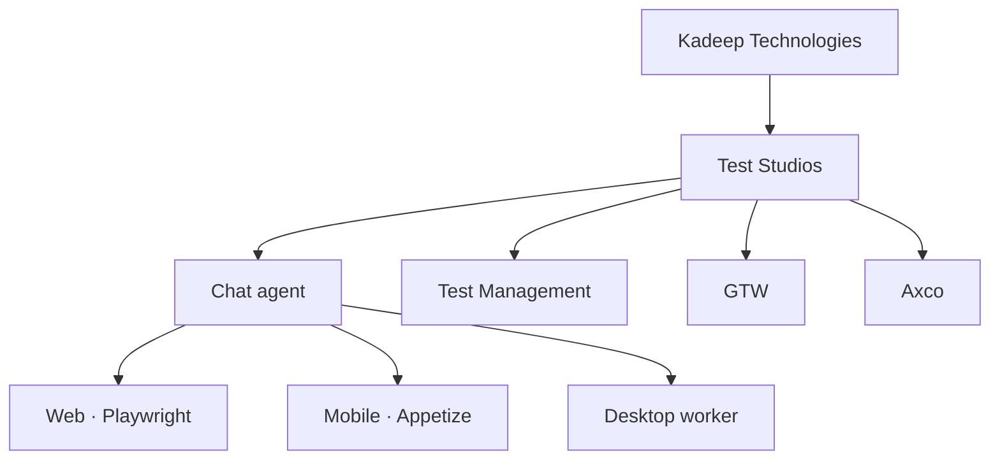
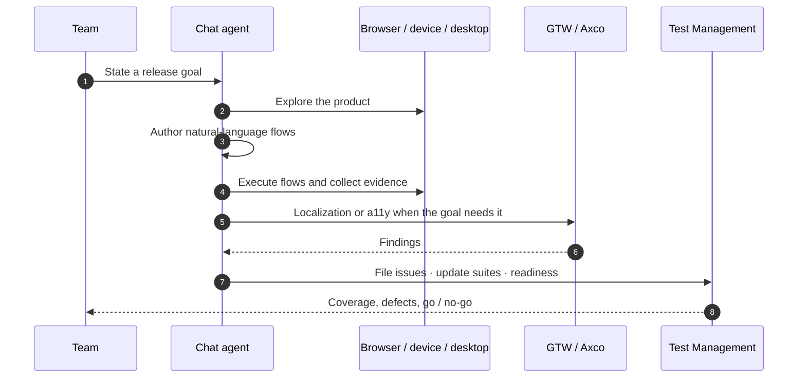

<picture>
  <source media="(prefers-color-scheme: dark)" srcset="https://capsule-render.vercel.app/api?type=waving&color=0:0d2137,50:0a3d62,100:1a6591&height=120&section=header" />
  <source media="(prefers-color-scheme: light)" srcset="https://capsule-render.vercel.app/api?type=waving&color=0:d6eaf8,50:7eb8d9,100:0a3d62&height=120&section=header" />
  
</picture>

<picture>
  <source media="(prefers-color-scheme: dark)" srcset="../assets/ks-logo-dark.svg" />
  <source media="(prefers-color-scheme: light)" srcset="../assets/ks-logo-light.svg" />
  
</picture>

# Kadeep Technologies

**[Test Studios](https://studio.kadeep.ai)** · *Release-ready, on demand*

A chat-first QA agent for web, mobile, and desktop — with test management, localization, and accessibility in one studio.

 

<picture>
  <source media="(prefers-color-scheme: dark)" srcset="https://readme-typing-svg.demolab.com?font=Fira+Code&weight=600&size=18&duration=3200&pause=1100&color=4FC3F7&center=true&vCenter=true&width=720&height=40&lines=Chat-first+QA+for+web%2C+mobile%2C+and+desktop;Test+management+%C2%B7+GTW+%C2%B7+Axco+in+one+studio;Explore+%C2%B7+flow+%C2%B7+run+%C2%B7+file+issues" />
  <source media="(prefers-color-scheme: light)" srcset="https://readme-typing-svg.demolab.com?font=Fira+Code&weight=600&size=18&duration=3200&pause=1100&color=0A3D62&center=true&vCenter=true&width=720&height=40&lines=Chat-first+QA+for+web%2C+mobile%2C+and+desktop;Test+management+%C2%B7+GTW+%C2%B7+Axco+in+one+studio;Explore+%C2%B7+flow+%C2%B7+run+%C2%B7+file+issues" />
  
</picture>

 

 

---

## What Test Studios is

Kadeep Technologies builds **one product**: [Test Studios](https://studio.kadeep.ai).

You talk to a senior QA engineer. It explores your web app, iOS / Android build, or desktop app; writes natural-language flows; runs them in a real browser or on a virtual device; files issues; and remembers what it learned — in governed memory (app / you / team) with credentials in a separate vault.

**GTW** (localization), **Axco** (accessibility), and **test management** are modules in that same workspace — not separate products.

> *“KaDeep helped us move from brittle automations to reliable agents. We finally have confidence in execution quality.”*
> — **Summit**, Product Manager, Setu

---

## Product map

One conversation. One runtime. One system of record.

---

## How a run works

---

## What’s inside

<table>
<tr>
<td width="50%" valign="top">

### Chat agent

The lead surface. Skills-based QA (smoke, regression, explore, mobile, desktop, and more). Live view of the browser or device. MCP for Cursor / Claude.

- Natural-language flows and suites
- Evidence, artifacts, and issue filing
- Governed memory + credential vault

</td>
<td width="50%" valign="top">

### Test Management

Flows, suites, schedules, and hooks as first-class objects — plus a project release dashboard.

- Execution, coverage, and defect ageing
- Release readiness and gate checks
- Export toward TestRail / Xray formats

</td>
</tr>
<tr>
<td width="50%" valign="top">

### GTW — localization

Locale, language, RTL, and formatting QA from the same agent — on device and in product journeys.

- Untranslated and truncated strings
- RTL mirroring and layout collisions
- Dates, currency, and number formats

</td>
<td width="50%" valign="top">

### Axco — accessibility

WCAG-oriented checks with axe, plus keyboard-only journeys on the real UI.

- Rule-mapped defects with impact
- Focus, labels, headings, and traps
- Mobile hierarchy review when on-device

</td>
</tr>
</table>

---

## Workspace

A tester **3-pane** layout: project and skills on the left, chat / plan in the middle, live runtime and evidence on the right. Managers get a QA release dashboard on the same project.

| Surface | What it is |
|:---|:---|
| **Web** | Full studio in the browser |
| **Desktop** | Same UI, plus a paired worker for native macOS / Windows apps |
| **Mobile companion** | Chat, HITL, watch-live, runs and defects against the same API |
| **Virtual devices** | Agent-driven iOS / Android sessions |

| In the studio | Use it for |
|:---|:---|
| Chat · Plan · Live runtime | Explore, author, watch, take control |
| Tests · Suites · Schedules | Flows, grouping, automations |
| Defects · Artifacts · Requirements | Issues, evidence, coverage inputs |
| Memory · Vault · Skills | What the agent remembers, secrets, playbooks |
| Release Readiness | Gates, coverage heatmap, defect analysis |

Integrations the agent can use: **GitHub, Jira, Linear**, Slack / Teams notify, MCP servers.

---

## Why this exists

| Without Test Studios | With Test Studios |
|:---|:---|
| Scripts only engineers can keep alive | Chat + natural-language flows the agent runs |
| Localization, a11y, and a TMS in three tools | GTW, Axco, and test management in one studio |
| Go / no-go is a meeting | Readiness, coverage, and evidence on the dashboard |
| QA knowledge lives in someone’s head | Governed memory across app, you, and team |

---

## Contact

| | |
|:---|:---|
| **Test Studios** | [studio.kadeep.ai](https://studio.kadeep.ai) |
| **Company** | [kadeep.ai](https://kadeep.ai) |
| **Demo** | [kadeep.ai/demo](https://kadeep.ai/demo) |
| **Blog** | [kadeep.ai/blog](https://kadeep.ai/blog) |
| **LinkedIn** | [KaDeep AI](https://www.linkedin.com/company/kadeep-ai) |

 

---

<picture>
  <source media="(prefers-color-scheme: dark)" srcset="https://capsule-render.vercel.app/api?type=waving&color=0:1a6591,50:0a3d62,100:0d2137&height=90&section=footer" />
  <source media="(prefers-color-scheme: light)" srcset="https://capsule-render.vercel.app/api?type=waving&color=0:0a3d62,50:7eb8d9,100:d6eaf8&height=90&section=footer" />
  
</picture>

Kadeep Technologies · Test Studios · © 2025–2026

