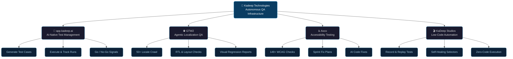
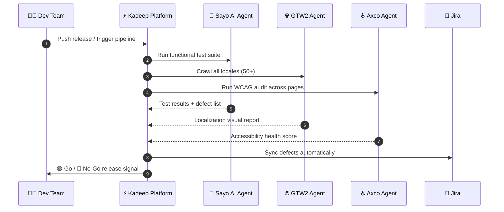
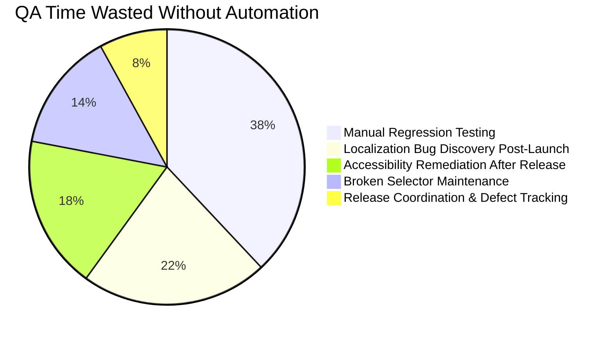

<div align="center">

<!-- ANIMATED WAVE HEADER -->


<!-- ANIMATED TYPING TAGLINE -->


<br/>

<!-- BADGES -->
[](https://kadeep.ai)
[](https://app.kadeep.ai)
[](https://www.linkedin.com/company/kadeep-ai)
[](https://kadeep.ai/demo)

<br/>


</div>

---

## 🧠 About Kadeep


At **Kadeep Technologies**, we design and develop AI-powered QA products and automation platforms that help engineering teams **move faster, release confidently, and scale effortlessly**.

Manual regression wastes sprints. Localization breaks silently. Accessibility slips until users complain. QA tools are scattered, fragile, and built for yesterday's workflows.

**We built Kadeep because every QA tool we tried was either too manual or too brittle.**

Kadeep runs your entire QA operation — functional testing, localization, accessibility, and release intelligence — with AI agents that work 24/7, across every product, every locale, every release.

> *"KaDeep helped us move from brittle automations to reliable agents. We finally have confidence in execution quality."*
> — **Summit**, Product Manager, Tepla

<br/>

---

## 🗺️ Platform Ecosystem



---

## 🚀 Our Products

<table>
<tr>
<td width="50%" valign="top">

### 🧪 [app.kadeep.ai](https://app.kadeep.ai) — AI Test Management

> *BrowserStack meets TestSigma, rebuilt for agent-first workflows*


Full test management where AI agents generate test cases, execute runs, log defects, and deliver release go/no-go signals — all from one place.

**✦ Features**
- ✅ AI-generated test case creation
- ✅ Automated test execution & run tracking
- ✅ Defect logging with Jira sync
- ✅ Release go/no-go signal generation
- ✅ Coverage visibility dashboards
- ✅ Agent-orchestrated regression suites

</td>
<td width="50%" valign="top">

### 🌐 [GTW2](https://gtw2.ai) — Agentic Localization QA

> *Your entire production site, QA'd across every locale. Automatically.*


GTW2 crawls your live site across 50+ locales, captures screenshots, and generates full visual QA reports on every release.

**✦ Features**
- ✅ Full page crawl across 50+ locales
- ✅ Broken layouts & missing string detection
- ✅ RTL failure detection
- ✅ Visual regression reports per release
- ✅ Zero TMS integration required
- ✅ Automated localization audit trail

</td>
</tr>
<tr>
<td width="50%" valign="top">

### ♿ [Axco](https://accessibility.kadeep.ai) — Accessibility Testing

> *Accessibility that audits itself, every release.*


Continuously monitors WCAG compliance across every deploy — not just at launch. Catch regressions before users do.

**✦ Features**
- ✅ 149+ violations detected & mapped to WCAG
- ✅ Health score 0–100 per release
- ✅ P1/P2 sprint fix plans with effort estimates
- ✅ AI-generated before/after code diffs
- ✅ axe-core + 396 WCAG 2.2 extended checks
- ✅ Jira/Linear export support

</td>
<td width="50%" valign="top">

### 🎬 [KaDeep Studios](https://app.kadeep.ai) — Low-Code Automation

> *If you can use a website, you can automate tests for it.*


Record-and-replay browser automation for everyone. The platform records every action and converts it into a structured, replayable test in the cloud.

**✦ Features**
- ✅ Record tests by simply using your site
- ✅ Sayo AI: self-healing selectors
- ✅ Cross-browser & cross-device cloud execution
- ✅ Zero setup, zero infrastructure
- ✅ Built for PMs, QAs, and BAs — not just devs
- ✅ Eliminates manual regression entirely

</td>
</tr>
</table>

---

## 📊 QA Pipeline — How Kadeep Works



---

## ⚔️ Why Kadeep?

<div align="center">

| 🔴 Without Kadeep | 🟢 With Kadeep |
|:---|:---|
| Manual regression testing eats sprint cycles | Sayo agents automate full regression suites 24/7 |
| Localization bugs silently reach end users | GTW2 audits every locale on every release automatically |
| Accessibility checked once at launch — never again | Axco monitors WCAG compliance across every deploy |
| Automation requires Selenium/Playwright engineering skills | KaDeep Studios: zero code, zero setup, record & replay |
| QA tools are siloed and fragmented | One unified platform — testing, a11y, l10n, release ops |
| Go/no-go is a gut call before release | AI agents deliver data-driven go/no-go signals |

</div>

---

## 📈 The Problem We Solve



---

## 🔒 Our Philosophy

<div align="center">

```
╔══════════════════════════════════════════════════════════════╗
║                                                              ║
║     BUILD SMART.    SHIP CONFIDENTLY.    SCALE PREDICTABLY.  ║
║                                                              ║
║    Quality is not a checkpoint — it's a continuous system.   ║
║                                                              ║
╚══════════════════════════════════════════════════════════════╝
```

</div>

---

## 📬 Get in Touch

<div align="center">

| | Link |
|:---:|:---|
| 🌐 | **Main Platform:** [kadeep.ai](https://kadeep.ai) |
| 🧪 | **Test Management:** [app.kadeep.ai](https://app.kadeep.ai) |
| 🌍 | **Localization QA:** [gtw2.ai](https://gtw2.ai) |
| ♿ | **Accessibility:** [accessibility.kadeep.ai](https://accessibility.kadeep.ai) |
| 💼 | **LinkedIn:** [linkedin.com/company/kadeep-ai](https://www.linkedin.com/company/kadeep-ai) |
| 📖 | **Blog:** [kadeep.ai/blog](https://kadeep.ai/blog) |
| 📩 | **Book a Demo:** [kadeep.ai/demo](https://kadeep.ai/demo) |

<br/>

[](https://kadeep.ai/demo)
[](https://app.kadeep.ai)

</div>

---

<div align="center">


</div>
