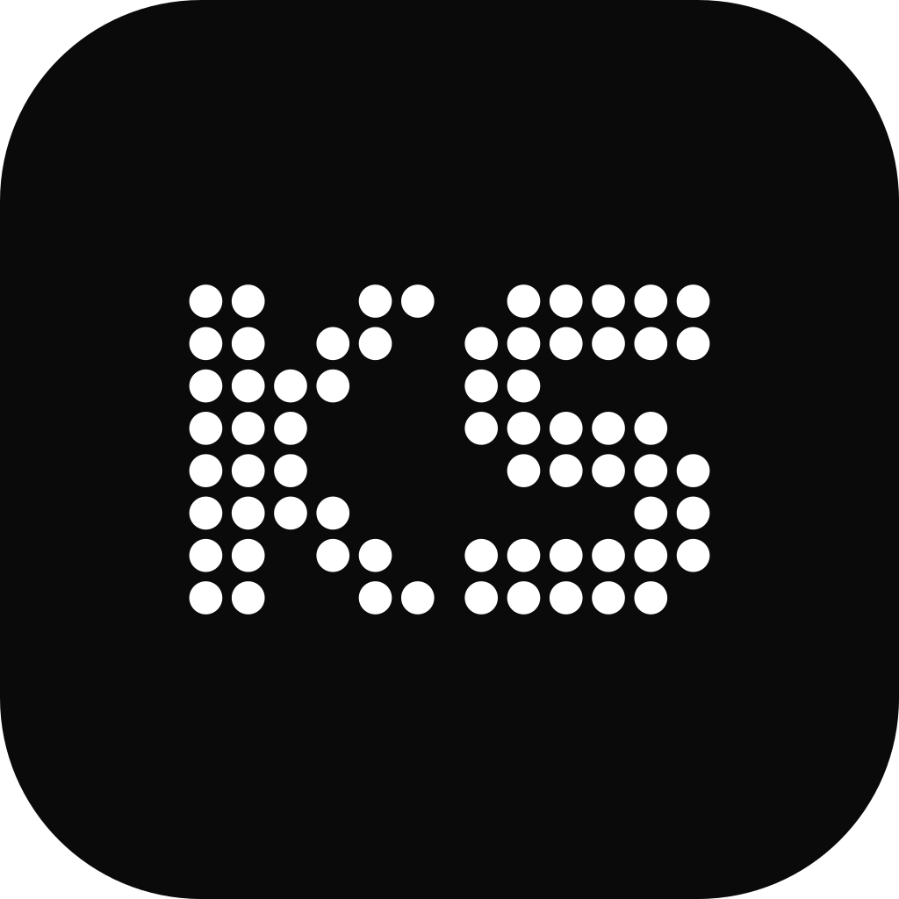
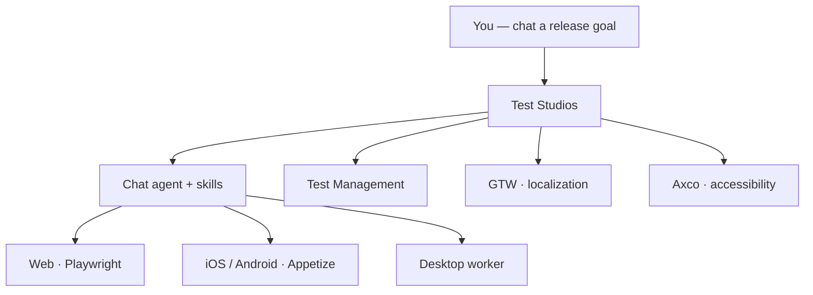
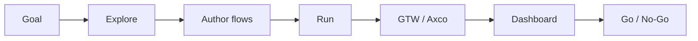
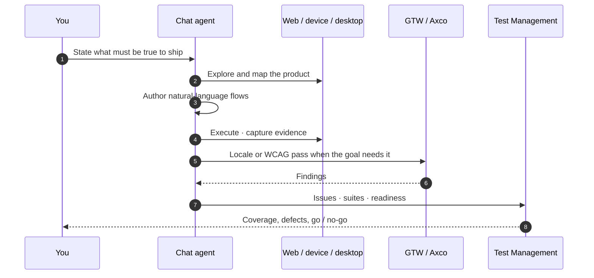
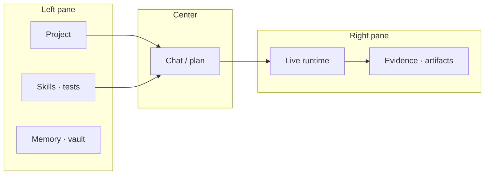

<picture>
  <source media="(prefers-color-scheme: dark)" srcset="https://capsule-render.vercel.app/api?type=waving&color=0:0d2137,50:0a3d62,100:1a6591&height=120&section=header" />
  <source media="(prefers-color-scheme: light)" srcset="https://capsule-render.vercel.app/api?type=waving&color=0:d6eaf8,50:7eb8d9,100:0a3d62&height=120&section=header" />
  
</picture>

<picture>
  <source media="(prefers-color-scheme: dark)" srcset="https://raw.githubusercontent.com/kadeep-ai/.github/main/profile/ks-logo-dark.svg" />
  <source media="(prefers-color-scheme: light)" srcset="https://raw.githubusercontent.com/kadeep-ai/.github/main/profile/ks-logo-light.svg" />
  
</picture>

# Kadeep Technologies

### [Test Studios](https://studio.kadeep.ai) — *Release-ready, on demand*

Talk to a senior QA engineer. It explores your product, writes the flows, runs them on web / mobile / desktop, files the issues, and tells you whether you can ship.

 

<picture>
  <source media="(prefers-color-scheme: dark)" srcset="https://readme-typing-svg.demolab.com?font=Fira+Code&weight=600&size=18&duration=3200&pause=1100&color=4FC3F7&center=true&vCenter=true&width=740&height=40&lines=Chat-first+QA+agent+for+web%2C+mobile+%26+desktop;Test+management+%C2%B7+GTW+%C2%B7+Axco+in+one+studio;Explore+%E2%86%92+flow+%E2%86%92+run+%E2%86%92+evidence+%E2%86%92+go+%2F+no-go" />
  <source media="(prefers-color-scheme: light)" srcset="https://readme-typing-svg.demolab.com?font=Fira+Code&weight=600&size=18&duration=3200&pause=1100&color=0A3D62&center=true&vCenter=true&width=740&height=40&lines=Chat-first+QA+agent+for+web%2C+mobile+%26+desktop;Test+management+%C2%B7+GTW+%C2%B7+Axco+in+one+studio;Explore+%E2%86%92+flow+%E2%86%92+run+%E2%86%92+evidence+%E2%86%92+go+%2F+no-go" />
  
</picture>

 

 

---

## The product

Kadeep Technologies builds **one product**: **[Test Studios](https://studio.kadeep.ai)**.

It is a chat-first QA agent with its own runtimes — Playwright in the browser, virtual iOS / Android devices, and a paired desktop worker. You describe a release goal. The agent explores, authors natural-language flows, executes them, keeps evidence, and files defects.

**Test management**, **GTW** (localization QA), and **Axco** (accessibility) are modules in that same studio — not separate products, not separate logins.

> *“KaDeep helped us move from brittle automations to reliable agents. We finally have confidence in execution quality, predictable behavior, and clear visibility into why an agent did what it did.”*
> — **Summit**, Product Manager, Tepla

> *“Testing agent workflows used to be guesswork. KaDeep gave us structured intent, traceable actions, and consistent outcomes.”*
> — **Anand Vasist**, Product Owner, Zilfo

---

## Product map

**One conversation. One runtime. One system of record.**

---

## Release loop

---

## How a run works

---

## What’s inside Test Studios

<table>
<tr>
<td width="50%" valign="top">

### Chat agent

The lead surface. You talk; it behaves like a QA lead — smoke, regression, explore, mobile, desktop, then a numbered summary.

- Natural-language flows, suites, and schedules
- Live view of the browser or device; take control when needed
- Governed memory (app / you / team) and a credential vault
- MCP for Cursor / Claude (`flows`, `suites`, `runs`, `issues`)

</td>
<td width="50%" valign="top">

### Test Management

The system of record for the work the agent just did — not a second product to log into.

- Flows, suites, hooks, and automations
- Release readiness, gates, coverage heatmap
- Defect ageing, leakage view, go / no-go
- Export toward TestRail CSV / Xray JSON

</td>
</tr>
<tr>
<td width="50%" valign="top">

### GTW — localization

Locale QA from the same agent: language, RTL, layout, and formatting — on journeys and on device.

- Untranslated strings and clipped labels
- RTL mirroring and overlapping UI
- Dates, currency, and number formats
- Visual evidence per language, filed as defects

</td>
<td width="50%" valign="top">

### Axco — accessibility

WCAG-oriented QA on the real UI, every time you ask — not a one-off launch audit.

- axe scans with impact-mapped issues
- Keyboard-only journeys (focus, labels, traps)
- Heading / name / contrast defects you can ship a sprint from
- Mobile hierarchy review when the run is on-device

</td>
</tr>
</table>

### Skills the agent can run

---

## Workspace — studio at a glance

The tester layout is three panes. Managers see the same project as a release dashboard.

| You work on | What it is |
|:---|:---|
| **Web** | Full studio in the browser — [studio.kadeep.ai](https://studio.kadeep.ai) |
| **Desktop app** | Same UI, plus a paired worker for native macOS / Linux apps |
| **Mobile companion** | Chat, approvals, watch-live, runs and defects — nothing executes on the phone |
| **Virtual devices** | Agent-driven iOS / Android sessions |

| In the studio | For |
|:---|:---|
| Chat · Plan · Live runtime | Explore, author, watch, take control |
| Tests · Suites · Schedules | Flows, grouping, nightly / interval automations |
| Defects · Artifacts · Requirements | Issues, proof, coverage inputs |
| Memory · Vault · Skills | What it remembers, secrets, playbooks |
| Release Readiness | Gates, heatmap, defect mix, go / no-go |

---

## Who opens Test Studios

| If you… | You use it to… |
|:---|:---|
| Own quality on a release | Chat the goal, get flows + evidence + a go / no-go |
| Are a PM or BA, not a SDET | Describe journeys in language; skip Selenium |
| Ship web + iOS / Android | Run the same intent across surfaces and catch parity gaps |
| Care about new locales | Ask GTW — strings, RTL, layout — without a second tool |
| Need WCAG on every cut | Ask Axco — axe + keyboard — in the same run |
| Live in GitHub / Jira / Linear | File and sync defects where the team already works |

---

## Why this exists

| The usual stack | Test Studios |
|:---|:---|
| Scripts only an SDET can keep alive | Chat + natural-language flows the agent runs on the live UI |
| TMS, l10n crawler, a11y scanner, device farm | One studio — test management, GTW, Axco, runtimes |
| Go / no-go is a meeting | Readiness, coverage, and evidence on the dashboard |
| Context lives in Slack and someone’s head | Governed memory across app, you, and team |

---

## Stack

---

## Contact

| | |
|:---|:---|
| **Product** | [studio.kadeep.ai](https://studio.kadeep.ai) |
| **Company** | [kadeep.ai](https://kadeep.ai) |
| **Blog** | [kadeep.ai/blog](https://kadeep.ai/blog) |
| **LinkedIn** | [KaDeep AI](https://www.linkedin.com/company/kadeep-ai) |
| **HQ** | Vikhroli West, Mumbai |

 

---

<picture>
  <source media="(prefers-color-scheme: dark)" srcset="https://capsule-render.vercel.app/api?type=waving&color=0:1a6591,50:0a3d62,100:0d2137&height=90&section=footer" />
  <source media="(prefers-color-scheme: light)" srcset="https://capsule-render.vercel.app/api?type=waving&color=0:0a3d62,50:7eb8d9,100:d6eaf8&height=90&section=footer" />
  
</picture>

Kadeep Technologies · Test Studios · © 2025–2026 · Mumbai

